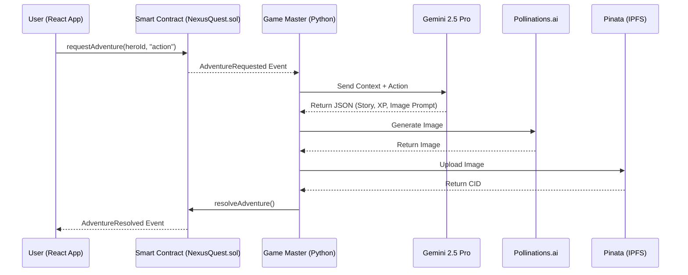

# ⚔️ NexusQuest: AI-Driven Web3 RPG & Marketplace

[](https://reactjs.org/)
[](https://soliditylang.org/)
[](https://www.python.org/)
[](https://deepmind.google/technologies/gemini/)

NexusQuest is a decentralized gaming ecosystem that bridges the gap between static NFTs and dynamic, interactive gameplay. By combining Ethereum smart contracts with generative AI, NexusQuest transforms standard ERC-721 tokens into living, breathing RPG characters whose attributes, stories, and visuals evolve entirely on-chain based on player choices.

---

# 🚀 The Concept: Living NFTs

In traditional Web3 games, NFTs are static images. In NexusQuest, your NFT **is the game state**.

When a player interacts with their Hero, they submit free-text actions. A Python-based **AI Game Master** interprets the action, calculates the outcome based on the hero’s Level and XP, generates a new image, and updates the blockchain.

---

# ✨ Key Features

## Dynamic AI Game Master
Powered by **Google Gemini 2.5 Pro**, the system acts as a strict Dungeon Master.

It:
- Judges player actions
- Scales difficulty based on hero level
- Punishes cowardly actions with **0 XP**
- Advances a persistent story campaign

## Generative Game Art
The system integrates with **Pollinations.ai** to generate **isometric RPG artwork** that depicts the outcome of each player action.

## Fully Decentralized State
Character data is stored on-chain:

- Hero Name
- XP
- AI-generated story outcome
- Image IPFS URI

## Integrated NFT Marketplace
Players can:
- List heroes
- Buy heroes
- Sell heroes

All transactions use **ETH** through a decentralized marketplace.

## Immutable Asset Storage
All images are stored on **IPFS via Pinata**, ensuring permanent decentralized storage.

---

## Project Structure

```
nexus-quest/
├── contracts/                 # Solidity smart contracts
│   ├── NexusQuest.sol        # ERC-721 NFT contract
│   └── Marketplace.sol       # Marketplace contract
├── scripts/                   # Deployment scripts
│   ├── deploy.js             # Deploy NexusQuest contract
│   ├── deploy_market.js      # Deploy Marketplace contract
│   └── deploy-all.js         # Deploy all contracts
├── client/                    # React frontend
│   ├── src/
│   │   ├── App.jsx           # Main application component
│   │   ├── main.jsx          # Entry point
│   │   ├── abi.json          # NexusQuest ABI
│   │   └── marketabi.json    # Marketplace ABI
│   └── vite.config.js        # Vite configuration
├── artifacts/                # Compiled contract artifacts
├── gamemaster.py             # Game logic and state management
├── check-hf.py              # Hugging Face integration check
├── hardhat.config.js         # Hardhat configuration
├── package.json              # Project dependencies
└── .env                       # Environment variables
```


# 🧠 Architecture Flow

The entire game loop is event-driven.



---

# ⚙️ Game Loop Breakdown

### 1. Player Action
The player types an action in the **React UI** and signs a transaction via **MetaMask**.

### 2. Smart Contract Event
`NexusQuest.sol` emits an `AdventureRequested` event.

### 3. Game Master Listener
A Python script (`gamemaster.py`) listens for the event.

It gathers:
- Hero XP
- Previous story
- Player action

Then sends them to Gemini.

### 4. AI Generation
Gemini returns JSON containing:

- Story result
- XP reward
- Image generation prompt

### 5. Image Generation
The prompt is sent to **Pollinations.ai** which returns a generated RPG image.

### 6. IPFS Storage
The image is uploaded to **Pinata IPFS** and returns a **CID**.

### 7. Blockchain Update
The Game Master calls `resolveAdventure()` which updates the NFT metadata.

### 8. UI Update
The React UI listens for `AdventureResolved` and updates instantly.

---

# 🛠️ Tech Stack

## Frontend

Framework:
- React
- Vite

Web3 Integration:
- Ethers.js v6

Styling:
- Custom Dark Fantasy CSS

---

## Smart Contracts

Language:
- Solidity 0.8.20

Framework:
- Hardhat

Libraries:
- OpenZeppelin

Standards:
- ERC-721Enumerable
- Ownable
- ReentrancyGuard

---

## Backend AI Game Master

Language:
- Python

Blockchain Interaction:
- Web3.py

AI Models:
- Google Gemini 2.5 Pro
- Pollinations.ai

Storage:
- IPFS
- Pinata API

---

# 💻 Local Setup & Installation

## 1 Clone Repository

```bash
git clone https://github.com/your-repo/nexusquest.git
cd nexusquest
```

---

## 2 Install Dependencies

```bash
npm install

cd client
npm install
cd ..
```

---

## 3 Environment Variables

Create `.env` files in **root** and **client** directories.

```
WEB3_PROVIDER_URI=HTTP://127.0.0.1:8545
PRIVATE_KEY=your_private_key_here
GEMINI_API_KEY=your_gemini_key
HUGGINGFACE_API_KEY=your_hf_key
IPFS_API_URL=http://127.0.0.1:5001/api/v0/add
PINATA_API_KEY=your_pinata_key
PINATA_JWT=your_pinata_jwt
PINATA_API_SECRET=your_pinata_secret
```

---

## 4 Start Local Blockchain

```bash
npx hardhat node
```

---

## 5 Deploy Smart Contracts

```bash
npx hardhat run scripts/deploy-all.js --network localhost
```

Copy the generated contract addresses and place them inside:

```
client/src/App.jsx
```

---

## 6 Start Application

Open two terminals.

### Terminal 1 – AI Game Master

```bash
python gamemaster.py
```

### Terminal 2 – React Frontend

```bash
cd client
npm run dev
```

Open:

```
http://localhost:5173
```

---

# 🔐 Smart Contract Security

### Reentrancy Protection

The Marketplace contract uses:

```
ReentrancyGuard
```

to prevent recursive withdrawal attacks.

### Game Master Authorization

The `resolveAdventure()` function is protected by:

```
onlyOwner
```

This ensures only the **authorized Game Master script** can modify hero stats.

## Key Files

- **hardhat.config.js**: Hardhat configuration with network settings
- **package.json**: Project dependencies and scripts
- **.env**: Environment variables (configure before running)
- **check-hf.py**: Validates Hugging Face API connectivity
- **gamemaster.py**: Core game logic and state management

## Networks

Configured networks in `hardhat.config.js`:

- **localhost**: Local Ganache instance (default)
- **sepolia**: Ethereum Sepolia testnet
- **mainnet**: Ethereum mainnet (for production)

## Development Workflow

1. Modify smart contracts in `contracts/`
2. Compile: `npx hardhat compile`
3. Deploy: `npx hardhat run scripts/deploy-all.js --network localhost`
4. Update ABIs in `client/src/` if needed
5. Run frontend: `cd client && npm run dev`
6. Test interactions in browser


## Troubleshooting

- **Connection refused**: Ensure Ganache is running on the configured RPC URL
- **Invalid private key**: Check `.env` file for correct private key format
- **Missing ABIs**: Regenerate ABIs after contract changes: `npx hardhat compile`
- **IPFS connection**: Verify IPFS daemon is running or Pinata credentials are correct


---

# 🤝 Contributing

Contributions are welcome.

Steps:

1. Fork the repository
2. Create a feature branch
3. Commit changes
4. Open a Pull Request

Issues and suggestions are also encouraged.

---

# 📄 License

This project is licensed under the **MIT License**.
